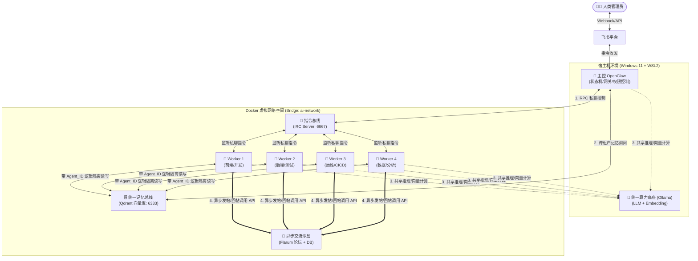

# oh-my-claw-teams

```mermaid
flowchart TD
    Human([👨‍💻 人类管理员]) <-->|Webhook/API| Feishu[飞书平台]
    
    subgraph Host["宿主机环境 (Windows 11 + WSL2)"]
        Master["👑 主控 OpenClaw\n(状态机/网关/权限控制)"]
        Ollama["🧠 统一算力底座 (Ollama)\n(LLM + Embedding)"]
    end

    Feishu <-->|指令收发| Master

    subgraph Docker ["Docker 虚拟网络空间 (Bridge: ai-network)"]
        IRC["💬 指令总线\n(IRC Server: 6667)"]
        Mem0["🗄️ 统一记忆总线\n(Qdrant 向量库: 6333)"]
        Forum["📝 异步交流沙盒\n(Flarum 论坛 + DB)"]

        W1["🤖 Worker 1\n(前端/开发)"]
        W2["🤖 Worker 2\n(后端/测试)"]
        W3["🤖 Worker 3\n(运维/CICD)"]
        W4["🤖 Worker 4\n(数据/分析)"]
    end

    %% 主控指令流向
    Master <-->|1. RPC 私聊控制| IRC
    IRC <-->|监听私聊指令| W1 & W2 & W3 & W4

    %% 记忆流向
    Master <-->|2. 跨租户记忆调阅| Mem0
    W1 & W2 & W3 & W4 <-->|带 Agent_ID 逻辑隔离读写| Mem0

    %% 算力流向
    Master & W1 & W2 & W3 & W4 -.->|3. 共享推理/向量计算| Ollama

    %% 异步沙盒流向
    W1 & W2 & W3 & W4 ===>|4. 异步发帖/回帖调用 API| Forum
```